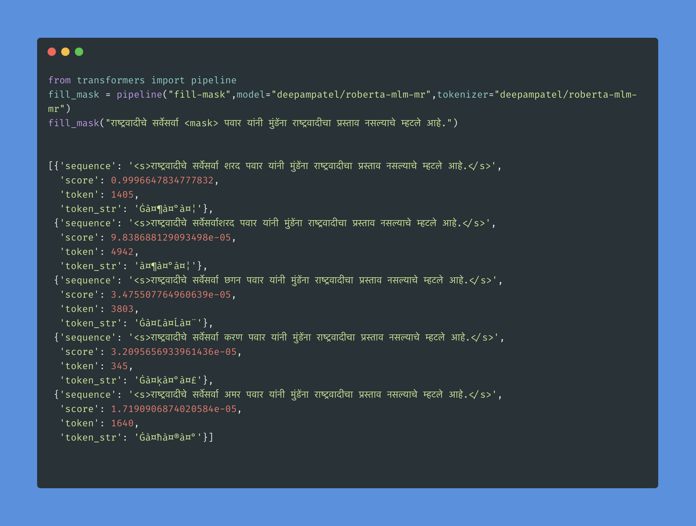

---
language: "mr"
---

# Welcome to Roberta-Marathi-MLM

## Model Description
 
> This is a small language model for [Marathi](https://en.wikipedia.org/wiki/Marathi) language with 1M data samples taken from
  [OSCAR page](https://oscar-public.huma-num.fr/shuffled/mr_dedup.txt.gz)



## Usage

```python
from transformers import AutoTokenizer, AutoModelWithLMHead  
tokenizer = AutoTokenizer.from_pretrained("deepampatel/roberta-mlm-mr")  
model = AutoModelWithLMHead.from_pretrained("deepampatel/roberta-mlm-mr")
```

## Training params 

- **Dataset** - 1M data samples are used to train this model from OSCAR page(https://oscar-corpus.com/) eventhough data set is of 2.7 GB due to resource constraint to train 
I have picked only 1M data from the total 2.7GB data set. If you are interested in collaboration and have computational resources to train on you are most welcome to do so.

- **Preprocessing** - ByteLevelBPETokenizer is used to tokenize the sentences at character level and vocabulary size is set to 52k as per standard values given by 🤗 
<!-- - **Hyperparameters** - __ByteLevelBPETokenizer__ : vocabulary size = 52_000 and  min_frequency = 2
                        __Trainer__ :               num_train_epochs=12 - trained for 12 epochs
                                                    per_gpu_train_batch_size=64 - batch size for the datasamples is 64
                                                    save_steps=10_000 - save model for every 10k steps
                                                    save_total_limit=2 - save limit is set for 2 -->

**Intended uses & limitations**
  this is for anyone who wants to make use of marathi language models for various tasks like language generation, translation and many more use cases.

**Whatever else is helpful!**
  If you are intersted in collaboration feel free to reach  me [Deepam](mailto:deepam8155@gmail.com)
